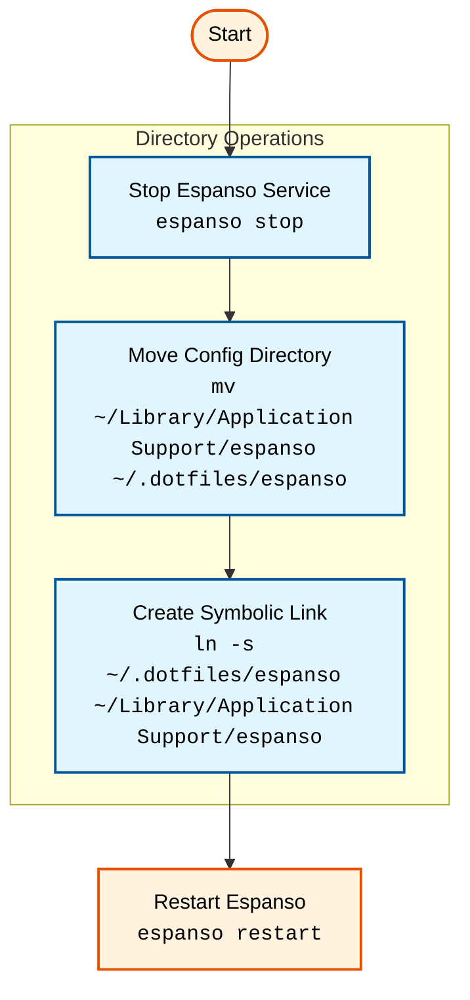

# Espanso Configuration Directory Management

Espanso is a cross-platform text expander that enhances your typing experience by replacing predefined triggers with expanded text.
By default, it stores its configuration in `~/Library/Application Support/espanso`, but this location can be customized for better organization and version control.

## Table of Contents
* [Process Overview](#process-overview)
* [Step-by-Step Instructions](#step-by-step-instructions)
* [Verification Steps](#verification-steps)
* [Troubleshooting](#troubleshooting)
* [Related Documentation](#related-documentation)


## Process Overview

The relocation process involves stopping the service, moving the configuration directory, creating a symbolic link, and restarting espanso. Here's a visual representation of the process:




## Step-by-Step Instructions

### 1. Stop Espanso Service

First, stop the running espanso service:
```bash
espanso stop
```

### 2. Move Configuration Directory

Move the existing configuration to your desired location:
```bash
mv ~/Library/Application\ Support/espanso ~/.dotfiles/espanso
```

### 3. Create Symbolic Link

Create a symbolic link pointing to the new location:
```bash
ln -s ~/.dotfiles/espanso ~/Library/Application\ Support/espanso
```

### 4. Restart Espanso

Restart the espanso service:
```bash
espanso restart
```

## Verification Steps

After completing the relocation:

1. Verify the symbolic link:
```bash
ls -la ~/Library/Application\ Support/espanso
```

2. Check espanso functionality:
```bash
espanso status
```

## Troubleshooting

If issues occur:

### Permission Issues

Verify permissions:
```bash
chmod -h 755 ~/.dotfiles/espanso
```

### Symbolic Link Problems

Check link integrity:
```bash
ls -la ~/Library/Application\ Support/espanso
```

### Service Issues

Ensure espanso service is running:
```bash
espanso start
```

## Related Documentation

- [Espanso Official Documentation](https://espanso.org/docs/get-started/)
- [Symlinks](https://www.howtogeek.com/297721/how-to-create-and-use-symbolic-links-aka-symlinks-on-a-mac/)
